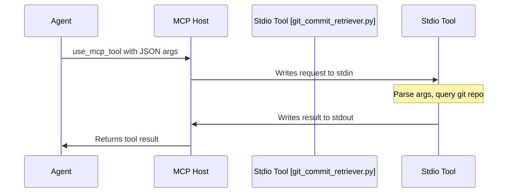

# MCP 工具设计: git_commit_retriever

这是一个用于检索 Git 仓库提交历史的 Stdio MCP 工具的设计文档。

## 1. 目标

创建一个可以通过编程方式调用的工具，用于查询指定 Git 仓库在特定分支下的提交历史。该工具需要支持按时间段和分页参数进行筛选。

## 2. 工作流程

该工具将作为 Stdio MCP 服务器运行。Agent 通过 MCP Host 向其标准输入（stdin）发送 JSON 格式的请求，工具处理请求后，将 JSON 格式的结果输出到标准输出（stdout）。



## 3. 工具 Schema

### 工具名称: `get_commits`

### 输入参数 (Input Schema)

| 参数名      | 类型    | 是否必须 | 描述                                                       |
| :---------- | :------ | :------- | :--------------------------------------------------------- |
| `repo_path` | string  | 是       | Git 仓库的本地绝对路径。                                   |
| `branch`    | string  | 是       | 要检索的分支名称。                                         |
| `since`     | string  | 否       | 起始时间 (ISO 8601 格式, e.g., "2023-01-01T00:00:00Z")。    |
| `until`     | string  | 否       | 结束时间 (ISO 8601 格式, e.g., "2023-01-31T23:59:59Z")。    |
| `skip`      | integer | 否       | 跳过的 commit 数量，用于分页。默认为 0。                   |
| `max_count` | integer | 否       | 返回的最大 commit 数量。默认为 50。                        |

**请求示例:**
```json
{
  "tool_name": "get_commits",
  "arguments": {
    "repo_path": "/path/to/my/repo",
    "branch": "main",
    "max_count": 10
  }
}
```

### 输出结果 (Output Schema)

工具成功时将返回一个 JSON 数组，其中每个元素都是一个 Commit 对象。

**Commit 对象结构**:

| 字段名         | 类型   | 描述                        |
| :------------- | :----- | :-------------------------- |
| `hexsha`       | string | 完整的 commit hash。        |
| `author_name`  | string | 作者姓名。                  |
| `author_email` | string | 作者邮箱。                  |
| `authored_date`| string | 提交时间 (ISO 8601 格式)。  |
| `message`      | string | 完整的 commit 消息。        |

**响应示例:**
```json
[
  {
    "hexsha": "a1b2c3d4e5f6a1b2c3d4e5f6a1b2c3d4e5f6a1b2",
    "author_name": "Roo",
    "author_email": "roo@example.com",
    "authored_date": "2023-10-27T10:00:00Z",
    "message": "feat: Initial commit"
  }
]
```

### 错误处理

如果发生错误（例如，仓库路径不存在、分支不存在），工具应向 `stderr` 输出错误日志，并向 `stdout` 输出一个空的 JSON 数组 `[]`。

## 4. 项目结构和技术选型

### 技术选型

*   **语言**: Python 3.x
*   **核心库**: `GitPython`
    *   **优点**:
        *   避免直接调用命令行，代码更健壮。
        *   提供面向对象的接口来操作 Git 对象。
        *   提供清晰的异常处理机制。

### 项目文件结构

```
/
├── git_mcp_tool.py       # 主程序入口：负责 MCP 通信。
├── git_handler.py        # Git 核心处理模块：封装 GitPython 交互逻辑。
├── requirements.txt      # 依赖文件 (GitPython)。
└── mcp_design.md         # 设计文档。
```

## 5. 核心逻辑设计 (git_handler.py)

以下是 `git_handler.py` 中核心函数 `find_commits` 的伪代码设计。

```python
# python pseudo-code

import git
from datetime import datetime

def find_commits(repo_path, branch, since=None, until=None, skip=0, max_count=50):
    """
    检索符合条件的 git commits。
    """
    try:
        # 1. 初始化 Git Repo 对象
        repo = git.Repo(repo_path)

        # 2. 准备 repo.iter_commits 方法的参数
        kwargs = {
            'rev': branch,
            'skip': skip,
            'max_count': max_count
        }
        if since:
            kwargs['since'] = since
        if until:
            kwargs['until'] = until

        # 3. 调用 iter_commits 获取迭代器
        commit_iterator = repo.iter_commits(**kwargs)

        # 4. 遍历迭代器，格式化结果
        results = []
        for commit in commit_iterator:
            results.append({
                "hexsha": commit.hexsha,
                "author_name": commit.author.name,
                "author_email": commit.author.email,
                "authored_date": commit.authored_datetime.isoformat(),
                "message": commit.message.strip()
            })
        
        return results

    except git.exc.NoSuchPathError:
        log_error_to_stderr(f"Error: Repo path not found at {repo_path}")
        return []
    except git.exc.GitCommandError as e:
        log_error_to_stderr(f"Error: Git command failed - {e}")
        return []
    except Exception as e:
        log_error_to_stderr(f"An unexpected error occurred: {e}")
        return []

def log_error_to_stderr(message):
    import sys
    print(message, file=sys.stderr)
```

## 6. 如何使用和本地测试 (已使用 fastmcp 重构)

### 安装依赖

```bash
pip install -r requirements.txt
```

### 作为 MCP Stdio 工具运行

此工具现在基于 `fastmcp` 框架。MCP Host 可以通过 `fastmcp` 命令行工具来运行它，或者直接执行 python 脚本。

```bash
# 方式一: 使用 fastmcp CLI
fastmcp run git_mcp_tool.py

# 方式二: 直接运行脚本
python git_mcp_tool.py
```

### 本地测试

`fastmcp` 简化了测试流程。我们可以使用 `fastmcp call` 命令来直接调用工具，无需手动构造 JSON 和使用管道。

1.  **调用工具:**
    在终端中执行以下命令。请将 `/path/to/your/git/repo` 替换为实际的仓库路径。

    ```bash
    fastmcp call git_mcp_tool.py get_commits --repo_path /path/to/your/git/repo --branch main --max_count 5
    ```

2.  **查看结果:**
    *   `stdout` 将会直接输出格式化的 JSON 结果。
    *   Git 操作相关的错误（如路径错误、分支不存在）会被 `git_handler` 捕获并打印到 `stderr`。